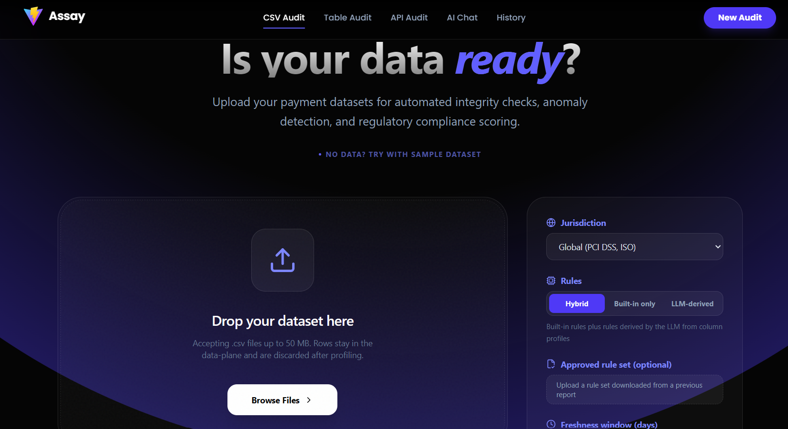
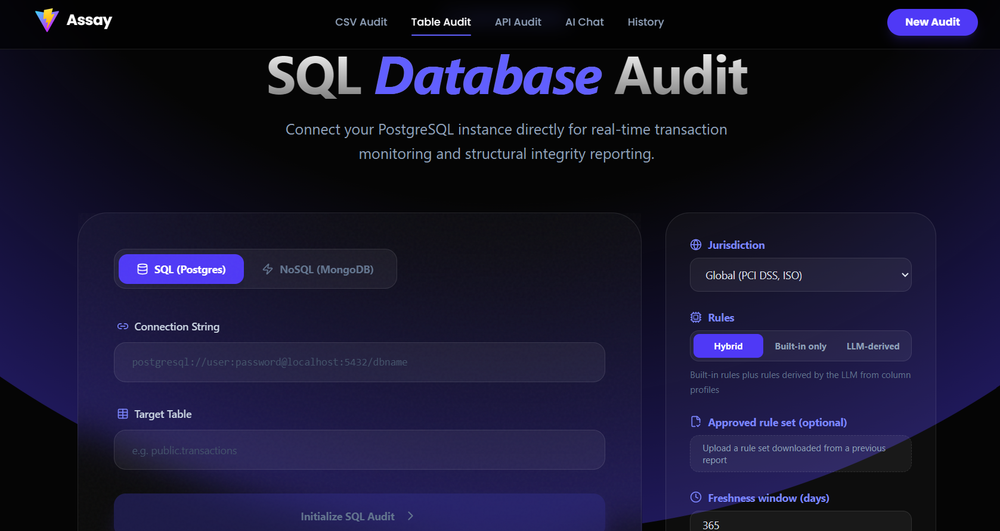
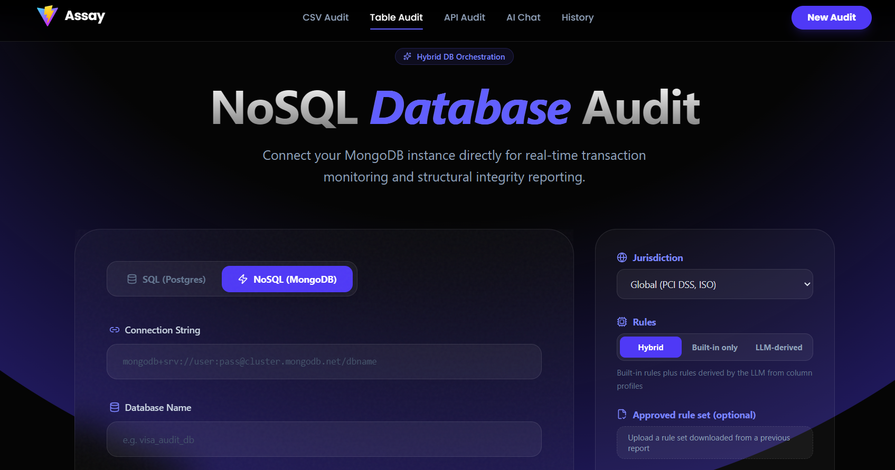
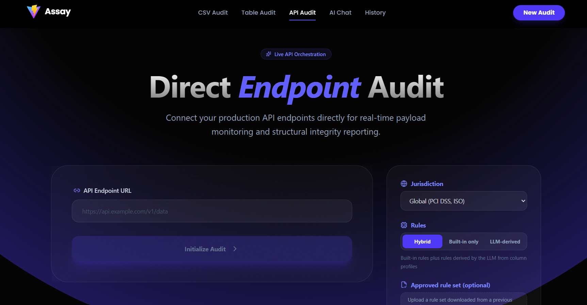
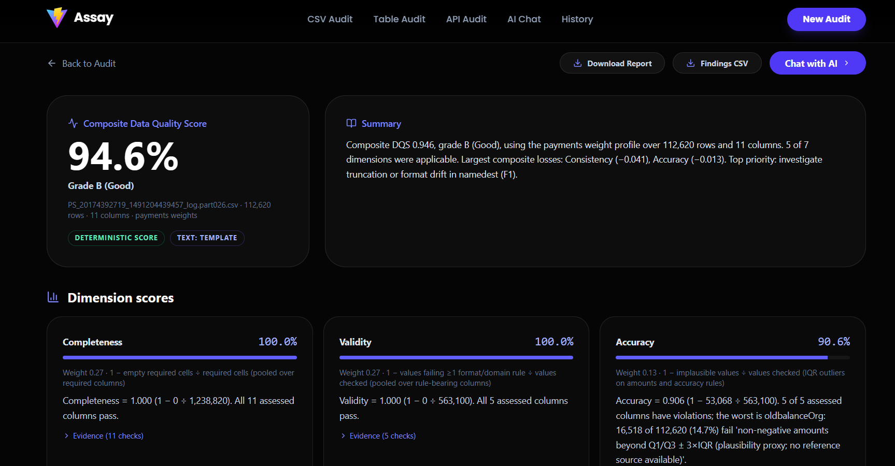
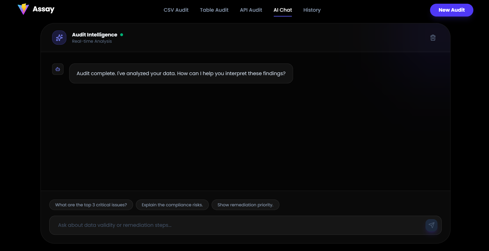
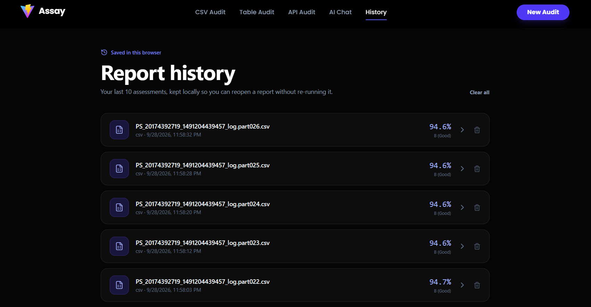
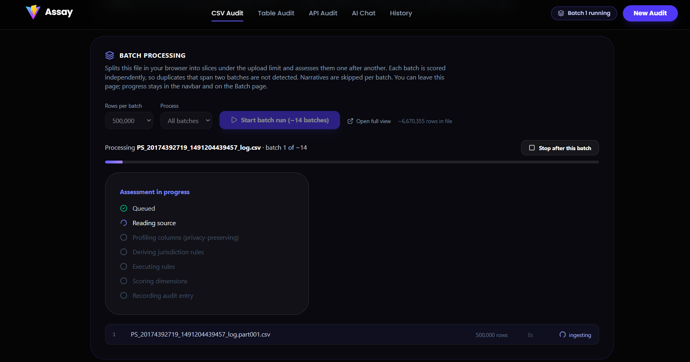
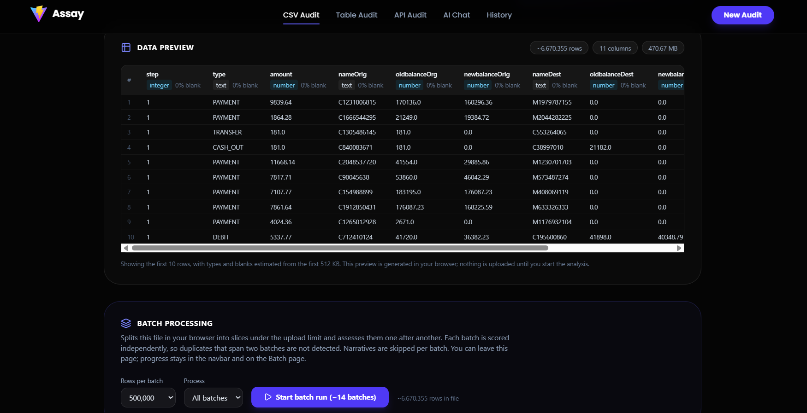
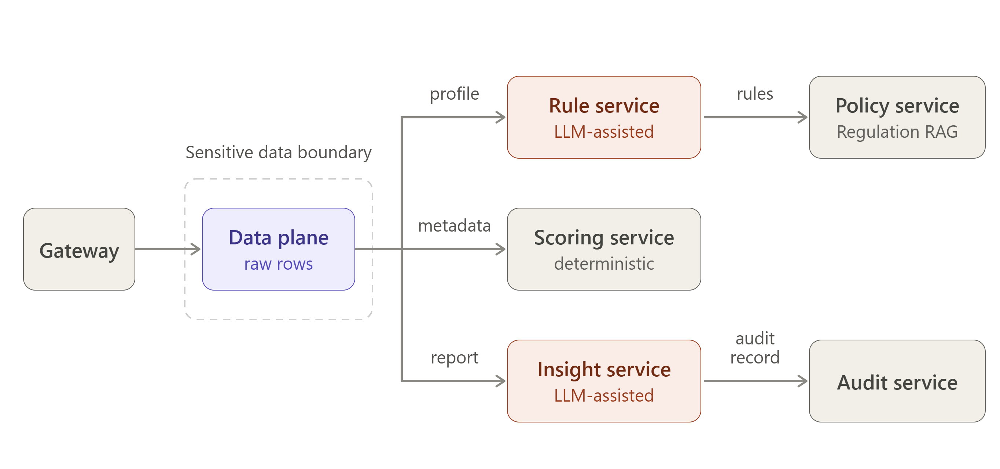

# Assay: Explainable, Governed Data Quality Scoring for Payments

Assay scores any tabular dataset (CSV, PostgreSQL, MongoDB or a REST API) on seven data
quality dimensions (Completeness, Validity, Accuracy, Consistency, Uniqueness,
Timeliness and Integrity) and produces a composite Data Quality Score (DQS). Each score
comes with the formula, the evidence behind it, prioritised fixes and the regulatory
context.

The design separates what must be objective from what benefits from language models:

| Concern | Who does it | Why |
|---|---|---|
| Profiling raw rows | data-plane (deterministic) | the only component that ever sees rows |
| Choosing which rules apply | built-in library + LLM rule derivation from column profiles, grounded in retrieved regulations | jurisdiction- and schema-aware, but every rule is validated and executed deterministically |
| Scoring | scoring-service (deterministic, no LLM) | identical metadata always gives an identical score |
| Explanations and recommendations | insight-service (LLM) | every number in generated text is checked against the engine's output; ungrounded text is discarded |
| Audit trail | audit-service (hash chain) | tamper-evident record of every assessment, holding no data values |


## Screenshots

<table>
<tr>
<td width="50%">

<p align="center"><sub>CSV upload — jurisdiction, rule mode (built-in / LLM-derived / hybrid) and freshness window are set before the run.</sub></p>
</td>
<td width="50%">

<p align="center"><sub>Connect a live PostgreSQL table for direct auditing, same rule and jurisdiction controls.</sub></p>
</td>
</tr>
<tr>
<td width="50%">

<p align="center"><sub>MongoDB is supported the same way as SQL, via the shared data-plane connector layer.</sub></p>
</td>
<td width="50%">

<p align="center"><sub>Or point Assay at a live API endpoint for direct payload auditing.</sub></p>
</td>
</tr>
<tr>
<td width="50%">

<p align="center"><sub>Composite DQS, grounded summary and per-dimension scores with formulas and evidence, all engine-computed.</sub></p>
</td>
<td width="50%">

<p align="center"><sub>Ask follow-up questions about a finished report; answers are grounded in the same report data.</sub></p>
</td>
</tr>
<tr>
<td width="50%">

<p align="center"><sub>Past assessments are kept locally so a report can be reopened without re-running it.</sub></p>
</td>
<td width="50%">

<p align="center"><sub>A large CSV is split into batches client-side and assessed one at a time, with live per-batch progress.</sub></p>
</td>
</tr>
<tr>
<td width="50%">

<p align="center"><sub>Aggregate view of a finished batch run; interrupted runs can be resumed by reselecting the same file.</sub></p>
</td>
<td width="50%"></td>
</tr>
</table>

## Architecture



| Service | Stack | Responsibility |
|---|---|---|
| `services/gateway` | Node, Express | Public API, CORS, rate and size limits, proxy with service token |
| `services/data-plane` | Node, Express | Connectors, SSRF guard, privacy-preserving profiling, rule DSL execution, async job pipeline |
| `services/ai` → `rule_service` | FastAPI | Derives DSL rules from column profiles + retrieved clauses; validates proposals and citations |
| `services/ai` → `scoring_service` | FastAPI | Dimension applicability, weights, pooled scores, findings, improvement pathway |
| `services/ai` → `insight_service` | FastAPI | Narrative, recommendations, chat, Markdown export, LLM-as-scorer ablation |
| `services/ai` → `policy_service` | FastAPI, ChromaDB | Clause-aware chunking; hybrid retrieval (BM25 + ChromaDB with local ONNX embeddings) filtered by jurisdiction |
| `services/ai` → `audit_service` | FastAPI | Append-only, hash-chained audit log with verification |
| `client` | React, Vite, Tailwind | Upload/connect, jurisdiction and rule-mode selection, live progress, report |

## Batch processing, resume and history

- **Batch CSV runs.** A large CSV is split client-side into row-bounded slices (respecting quoted
  multi-line fields, never holding more than one slice in memory) and assessed one batch at a time
  against the gateway, so a single file isn't bound by the upload size limit. Each batch produces its
  own report; the `/batch` page shows live per-batch progress and an aggregate view.
- **Resumable runs.** Batch progress (and the in-flight job id) is mirrored to `localStorage`. If the
  tab is closed or reloaded mid-run, reopening the app re-attaches to the job that was still running
  and lets you resume the remaining batches by reselecting the same file — completed batches are
  skipped. A single (non-batch) assessment left running on reload is resumed the same way via
  `useResumeAssessment`.
- **Local history.** The last 10 finished reports are kept in `localStorage` (nothing is sent
  anywhere) and can be reopened from `/history` without re-running the assessment.
- **Export.** Finished reports can be exported to PDF or CSV from the client, including an aggregate
  PDF across a whole batch run.

## Privacy and governance

- **Rows never leave the data-plane.** Other services receive aggregates (counts, ratios), format masks
  such as `AAAAA9999A`, and full value lists only for low-cardinality, non-sensitive code columns. The
  report's `governance` block lists exactly which value-level fields were included and which were suppressed.
- **PII firewall.** Every LLM payload passes through a redactor for emails, Luhn-valid card numbers, PAN,
  Aadhaar, phone numbers and URL secrets, as defence in depth. Redaction counts are recorded.
- **Sensitive-data detection.** Columns are tagged PII, KYC or PCI from values and names. Stored CVVs and unmasked
  PANs are flagged against PCI DSS v4.0 Req. 3.3 and 3.5.1.
- **Local LLM option.** Set `LLM_PROVIDER=ollama` to keep every step on the machine (`docker compose --profile local-llm`).
- **Auditability.** Each assessment writes a hash-chained entry (fingerprint, scores, rule sources, models,
  grounding). `GET /api/audit/verify` detects any edited or deleted entry.
- **Security.** SSRF protection resolves DNS and blocks private, loopback, link-local and metadata ranges with no
  redirects. Table names are allow-listed and quoted. TLS certificate verification is on by default.
  Services authenticate each other with `INTERNAL_SERVICE_TOKEN`.

## Running

**Docker** (requires Docker Desktop running):

```bash
cp services/ai/.env.example services/ai/.env      # add GROQ_API_KEY, or set LLM_PROVIDER=ollama
docker compose up --build                         # client on http://localhost, gateway on :5000
docker compose --profile local-llm up --build     # adds Ollama; then: docker exec dqs-ollama ollama pull qwen2.5:7b-instruct
```

**Without Docker** (Git Bash, Linux or macOS):

```bash
cd services/ai && python -m venv venv && venv/Scripts/pip install -r requirements.txt   # venv/bin on Linux/macOS
cd ../gateway && npm install && cd ../data-plane && npm install && cd ../..
bash scripts/run_local.sh
cd client && npm install && VITE_API_URL=http://localhost:5000/api npm run dev
```

## API (gateway)

| Method | Path | Purpose |
|---|---|---|
| POST | `/api/assessments/csv` (multipart), `/api/assessments/{postgres,mongo,api}` | Start an assessment; returns `202 {job_id}`. Options: `jurisdiction` (GLOBAL, IN, EU, US), `rule_mode` (builtin, llm, hybrid), `narrative`, optional approved `rules` |
| GET | `/api/assessments/:id` | Job status, stage timings and the report (`?include=metadata` for the metadata) |
| POST | `/api/chat`, `/api/chat/stream` | Questions about a report |
| POST | `/api/reports/export` | Markdown report |
| GET | `/api/audit/events`, `/api/audit/verify` | Audit trail and integrity check |
| GET | `/api/policies/stats`, `/api/health/services` | Regulation index and service health |

## Tests

```bash
cd services/ai && venv/Scripts/python -m pytest -q        # engine, grounding, rules, RAG, governance, APIs
cd services/data-plane && npm test                         # profiling, rule DSL, pipeline, SSRF
cd services/gateway && npm test                            # proxying, streaming, health
```

## Evaluation

See [evaluation/README.md](evaluation/README.md). It covers a seeded synthetic benchmark with an independent oracle
(including clean and single-defect controls), the LLM-as-scorer ablation, and a Kaggle track that measures
defect recovery on real financial datasets.

## Limitations

- Accuracy without a reference source is a plausibility proxy (outliers and range rules), not true correctness.
- Database and API sources are sampled up to `DQ_DB_ROW_LIMIT` rows (default 1000); the report says when a sample may be truncated.
- The bundled regulation corpus is a small seed (a GDPR excerpt and an unofficial RBI summary). Add the official texts
  listed in `services/ai/policy_corpus/README.md` before relying on citations.
- Groq is used for development. The local-model (Ollama) configuration is implemented but has not been evaluated yet.
